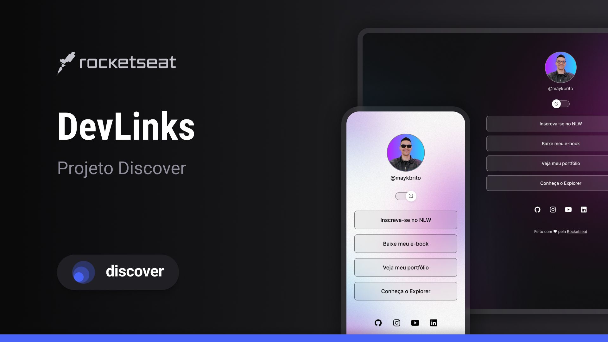

<h1 align='center'> DevLinks </h1>

Evento exclusivo e gratuito, promovido pela Rocketseat para ensino de tecnologias WEB.

   

      <a href="#-tecnologias"> Tecnologias </a>&nbsp;&nbsp:&nbsp;|&nbsp;&nbsp:&nbsp;
      <a href="#-projeto"> Projetos </a>&nbsp;&nbsp:&nbsp;|&nbsp;&nbsp:&nbsp;
      <a href="#-layout"> Layout </a>&nbsp;&nbsp:&nbsp;|&nbsp;&nbsp:&nbsp;
      <a href="#-memo-licença"> Licença </a>&nbsp;&nbsp:&nbsp;|&nbsp;&nbsp:&nbsp;
    

   

    
   

   

    
   

## Tecnologias

    - HTML e CSS
    - Javascript
    - Git e Github
    - Figma

## Projeto

    O DevLinks é um agregador de links para usar como cartão de visitas online.

## Layout

    Vocë pode visualizar o layout do projeto através [LINK](https://www.figma.com/file/MNanbbWGbaZSZIMwBJl3jx?embed_host=share&kind=file&mode=design&node-id=1437%3A191&t=XyuU7ZVS7U1BDH7k-1&type=design&viewer=1)

## :memo: Licença

Esse projeto está sob a licença MIT.

--

Feito pela Rocketseat :wave: [Participe da nossa comunidade!](https://discord.gg/rocketseat)
